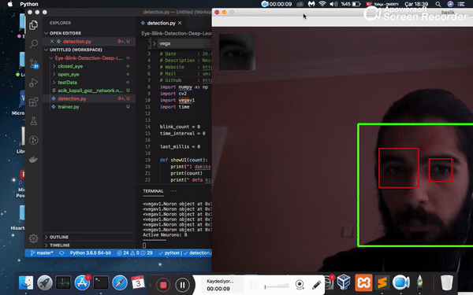
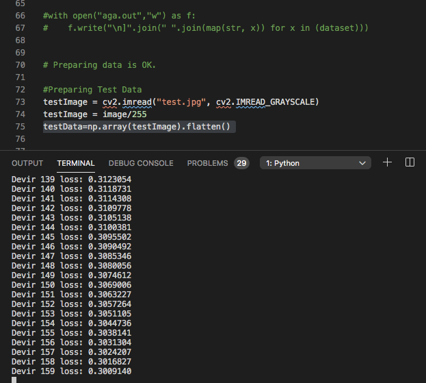

# Örnek Proje : Vega ile göz yorgunluğunu algılayan yapay zeka projesi

Bu proje, bir dakika içerisinde kaç defa göz kırpıldığını algılayarak, tıbbi sınır olarak kabul edilen dakikada 15 göz kırpmanın aşılmasının ardından kullanıcıyı uyarmaktadır. Vega kütüphanesi bu proje kapsamında göz fotoğraflarının açık veya kapalı olduğunun algılanması için kullanılmaktadır.

Proje kapsamında 1500 civarı 24x24 piksel çözünürlüğünde açık ve kapalı göz fotoğrafları ağı eğitmek için kullanılmıştır. OpenCV kütüphanesini kullanarak grayscale\(siyah-beyaz\) tonlarında olan görseller, 24x24 boyutunda ve renk değerleri 0 ile 1 arasına sıkıştırılmış bir matrise dönüştürülmüştür. Ardından bu matris, ağın daha kolay eğitilebilmesi için bir sıkıştırma işleminden geçirilmiş ve 6x6 boyutlarına indirgenmiştir.

Bu işlemlerden sonra, tüm resimler düzleştirilmiş, yani 36 elemanlı düz bir dizi haline getirilmiştir.


Eğitimin daha hızlı ve kolay olması için daha ufak bir dataset kullanılmıştır. Dilerseniz daha büyük bir dataset de kullanabilirsiniz.


Bu 36 elemanlı dizi, görsel sayısı kadar elemanlı dataset \(görseller\) dizisinin bir elemanıdır.

Bu dataseti eğitmek için,

`SinirAgi = vegav1.Katman([4,4], [36,36])`

Metodu ile 4 nöronu olan 2 adet katman oluşturulur. Bu katmanlardaki tüm nöronların weight sayısı ise 36 olarak belirlenmiştir. Zira eğitim dizimiz de 36 elemanlı olduğundan, en iyi öğrenme için 36 weight olmalıdır.

`learning_rate = 0.001`

`epoch = 5000`

Öğrenme oranı ve devir sayısı tercihe göre değiştirilebilir. Vega henüz multithreading desteklemediğinden yüksek devir sayıları fazla uzun sürebilmektedir.

Sinir ağını eğitmek için dataset adında 1500 elemanlı ve her elemanı da 6x6 resim matrisinin düzleştirilmiş 36 elemanlı dizisinden oluşmaktadır.

Targets değişkeni ise, 1500 adet 1 ve 0 sayısından oluşmaktadır. Dataset dizisindeki örneğin 5.görselde göz açık ise 1, kapalı ise 0 olacak ve eşleşecek şekilde oluşturulmuştur.

Yani dataset’ deki \(i\) numaralı her gözün açık veya kapalı olma durumu, targets dizisinin \(i\) numaralı elemanında belirtilmektedir.

`SinirAgi.train(dataset, targets,learning_rate, epoch)`

Train metodu ile öğrenme süreci 5000’inci devire kadar sürecektir. Loss değerinin düşmesi, ağın başarılı bir öğrenme süreci geçirdiği anlamına gelir

Öğrenme işleminin ardından bellekteki güncellenmiş ağırlıklar, Json formatında bir dosyaya kaydedilebilir. Bunun için

`SinirAgi.saveModel("acik_kapali_goz__network")`

Fonksiyonu kullanılır. Böylece **acik\_kapali\_goz\_\_network.neurons**

İsimli bir ağırlık dosyası kaydedilmiş olunur.

Bu metod ile;

`testData=np.array(testImage).flatten()`

eğitilmiş ağı test etmek için bir göz fotoğrafı test verisi olarak hazırlanır.


Buraya kadar anlatılan içerik, kaynak kodlardaki trainer.py dosyasında bulunmaktadır. Yani ağı tekrar eğitmek için python3 trainer.py komutunu çalıştırmalısınız.


`#Make Prediction After Training`

`prediction = SinirAgi.feedforward(testData)`

`print(prediction)`

feedforward metodu ile ağın tahmin edilen değeri ekrana yansıtılır. Eğer ağ tarafından tahmin edilen eğer 1’e yakınsa testData fotoğrafındaki göz açık, 0’a yakınsa ise kapalı demektir.

Daha fazla ağ ve daha fazla epoch ile daha keskin sonuçların alınması sağlanılabilir.

[http://github.com/Aksoylu/deep-learning-eye-blink-detection](https://github.com/Aksoylu/Eye-Blink-Detection-Deep-Learning-Project)

bağlantısı üzerinden projenin kaynak kodlarıne erişilebilir.

Projenin tamamında webcam kullanılarak \(OpenCV yardımı ile\) kullanıcının gözü anlık olarak algılanmakta ve tüm işlemler arka planda gerçekleştirilerek kullanıcıya yalnızca sonuç sunulmaktadır.

\*\*\*\*

